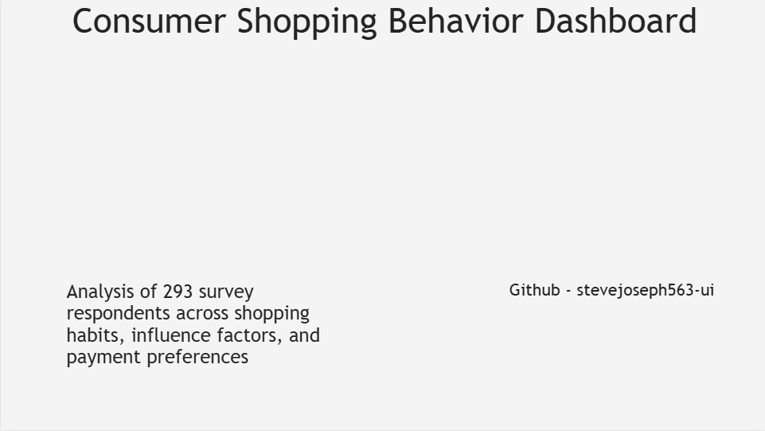
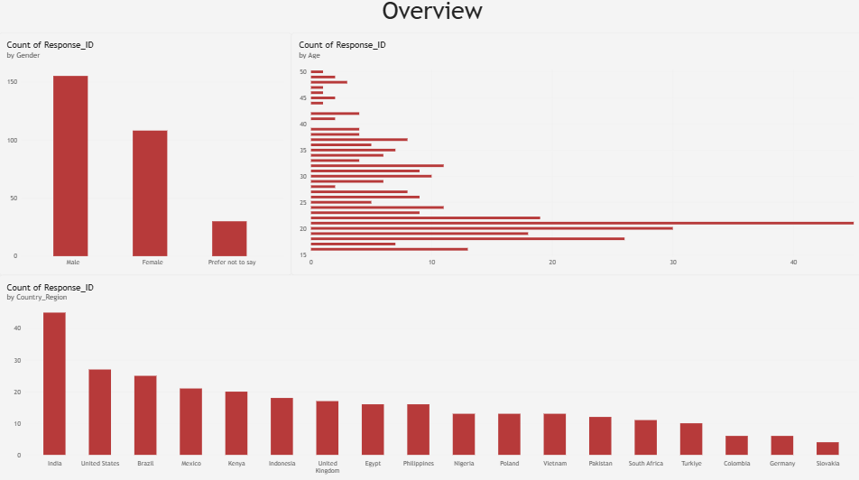
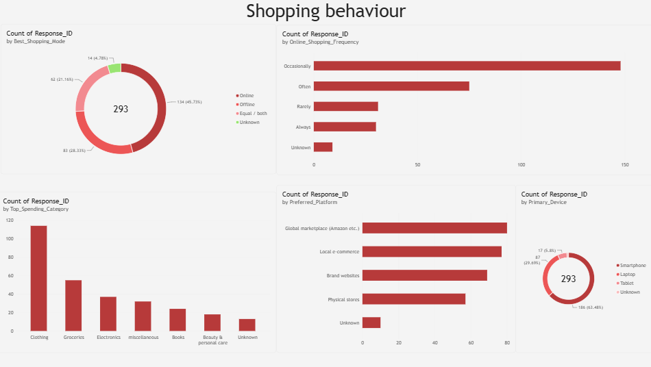
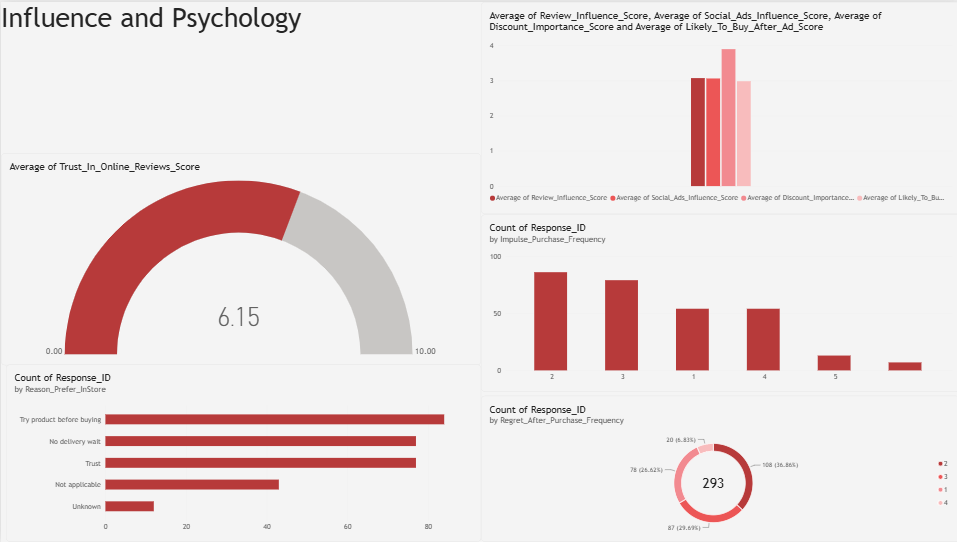
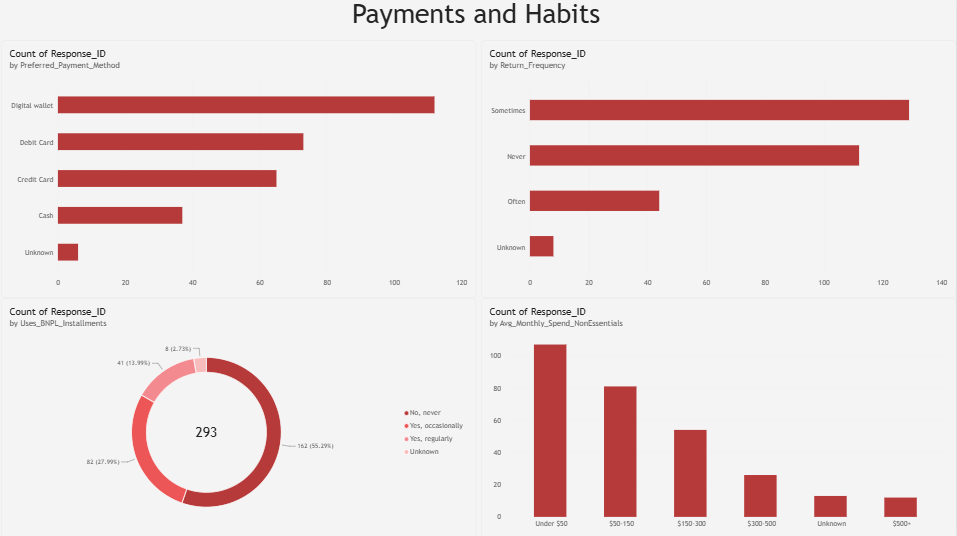

# Consumer Shopping Behavior Dashboard

An end-to-end data analysis project exploring **online vs. in-store shopping habits, purchase influences, and payment preferences** across 293 survey respondents from 19 countries.

**Tools used:** MySQL (data cleaning & storage) → Power BI (visualization)

---

## Dashboard Preview

### Cover


### Overview — Demographics


### Shopping Behavior


### Influence & Psychology


### Payments & Habits


---

## Project Overview

This project takes a raw consumer shopping survey (500 responses, 30 questions covering demographics, shopping habits, psychological influence scores, and payment behavior) and turns it into a clean, structured dataset and an interactive 4-page dashboard.

**Process:**
1. Imported the raw CSV into a MySQL database
2. Cleaned and validated the data (handled missing values, verified data types, added a primary key)
3. Connected the cleaned MySQL database to Power BI
4. Built a 4-page dashboard covering demographics, shopping behavior, psychological influences, and payment habits

---

## Data Cleaning Summary

| Step | Rows / Columns Affected | Decision |
|---|---|---|
| CSV import (500 rows) | 167 rows skipped by import wizard (type mismatches / malformed values) | Started with 333 rows |
| Missing core fields (Gender, Country, Occupation) | 40 rows | **Removed** — these are used in nearly every chart |
| Missing behavioral/payment fields (15 columns) | 116 of 293 rows affected (~40%) | **Replaced with "Unknown"** rather than deleted, to preserve sample size |
| Missing numeric scores (Price_Comparison_Frequency, Impulse_Purchase_Frequency) | 22 of 293 rows affected (~7.5%), no overlap | **Left as NULL** — filling numeric scores with a placeholder would distort averages; BI tools exclude NULLs from calculations automatically |

**Final dataset: 293 rows, 30 columns. All categorical fields are complete (using "Unknown" where unanswered); two numeric score fields retain a small number of genuine NULLs rather than fabricated values.**

The full SQL used for setup and cleaning is in [`cleaning_and_setup.sql`](cleaning_and_setup.sql).

---

## Key Insights

- **Online shopping is the clear preference**: 45.7% of respondents shop mostly online, 28.3% mostly in-store, and 21.2% split evenly between both.
- **India, the US, and Brazil** are the top three countries represented in the survey.
- **Digital wallets** are the most preferred payment method, ahead of debit cards, credit cards, and cash.
- **Trust in online reviews** averages 6.15/10 — moderate, not overwhelming, trust.
- **Global marketplaces (e.g. Amazon)** and **local e-commerce** are the two most-used shopping platforms, both ahead of brand websites and physical stores.
- Respondents most often prefer online shopping for **better prices and more variety**, while in-store shopping is favored for the ability to **try before buying** and **trust**.

---

## Repository Contents

```
├── README.md
├── cleaning_and_setup.sql          # Full SQL: schema, import notes, cleaning, verification
├── cleaned_shopping_survey.csv     # Final cleaned dataset (293 rows)
├── screenshots/                    # Dashboard page exports
└── dashboard.pbix                  # Power BI file (optional, if included)
```

---

## Author

**Steve Joseph** — [GitHub: stevejoseph563-ui](https://github.com/stevejoseph563-ui)
